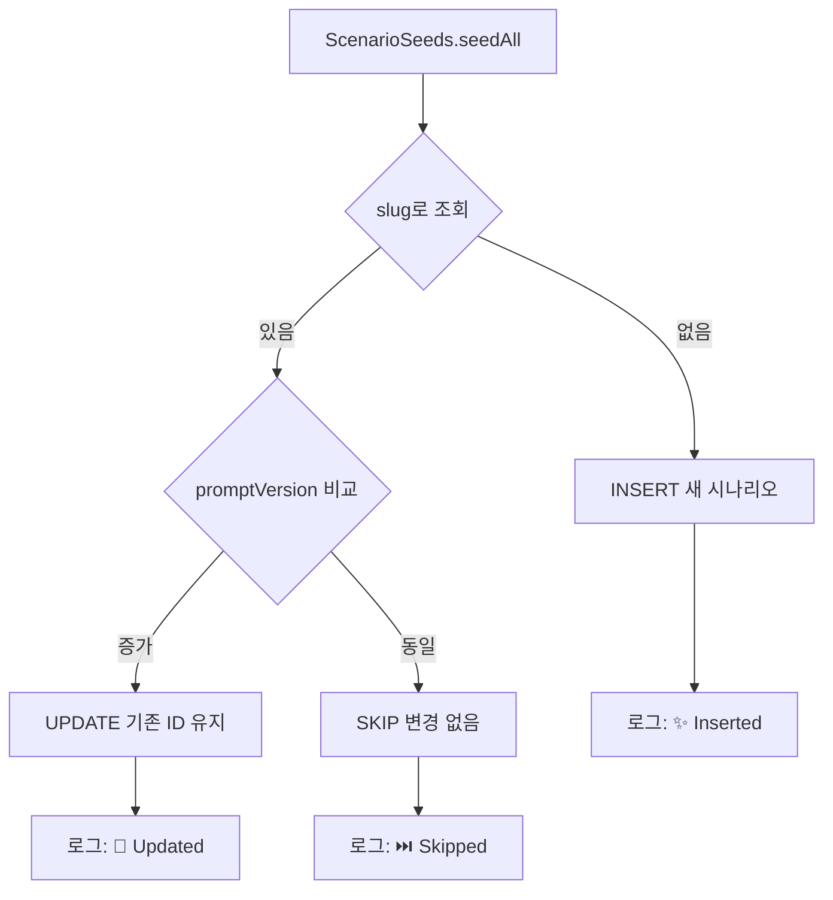

# 🏗️ 아키텍처

```
app/
├── src/main/java/com/nihongo/conversation/
│   ├── data/                 # 데이터 레이어
│   │   ├── local/            # Room DB
│   │   ├── remote/           # API 클라이언트
│   │   └── repository/       # Repository 구현
│   ├── domain/               # 도메인 레이어
│   │   ├── model/            # 데이터 모델
│   │   │   ├── SentenceCard.kt           # 문장 카드 (NEW!)
│   │   │   ├── EnhancedPronunciation.kt  # 향상된 발음 (NEW!)
│   │   │   ├── GrammarFeedback.kt        # 문법 피드백 (NEW!)
│   │   │   ├── ScenarioGoal.kt           # 시나리오 목표 (NEW!)
│   │   │   └── VoiceOnlyMode.kt          # 음성 전용 (NEW!)
│   │   ├── analyzer/         # 음성/발음 분석기 (NEW!)
│   │   │   ├── PitchAccentAnalyzer.kt
│   │   │   ├── SpeedRhythmAnalyzer.kt
│   │   │   └── ProblematicSoundsDetector.kt
│   │   ├── usecase/          # 비즈니스 로직
│   │   └── repository/       # Repository 인터페이스
│   ├── presentation/         # 프레젠테이션 레이어
│   │   ├── chat/             # 대화 화면
│   │   │   ├── VoiceOnlyComponents.kt    # 음성 전용 UI (NEW!)
│   │   │   └── FeedbackCard.kt           # 피드백 카드 (NEW!)
│   │   ├── pronunciation/    # 발음 분석 UI (NEW!)
│   │   │   ├── PitchAccentVisualization.kt
│   │   │   └── IntonationVisualizer.kt
│   │   ├── study/            # 학습 UI (NEW!)
│   │   │   └── SentenceCardPracticeSheet.kt
│   │   ├── flashcard/        # 플래시카드 복습 및 통계
│   │   ├── vocabulary/       # 커스텀 단어 추가
│   │   ├── user/             # 유저 선택/관리
│   │   ├── scenario/         # 시나리오 목록
│   │   ├── stats/            # 통계 화면
│   │   ├── review/           # 복습 화면
│   │   └── theme/            # 테마 설정
│   └── core/                 # 공통 유틸리티
│       ├── di/               # Dependency Injection
│       ├── session/          # 세션 관리 (UserSessionManager)
│       ├── network/          # 네트워크 모니터링/오프라인
│       ├── voice/            # STT/TTS
│       └── util/             # 헬퍼 함수
│           ├── DataInitializer.kt   # 앱 초기화 오케스트레이션
│           └── ScenarioSeeds.kt     # 126개 시나리오 데이터 (NEW!)
└── build.gradle.kts
```

## 🛠️ 기술 스택

- **UI**: Jetpack Compose + Material 3
- **Architecture**: MVVM + Clean Architecture
- **DI**: Hilt (Dagger)
- **Database**: Room (SQLite) + Paging 3
  - 11개 최적화 인덱스 (복합 인덱스 포함)
  - 데이터베이스 뷰 (conversation_stats)
  - 스트리밍 쿼리 최적화
- **Persistence**: DataStore Preferences (Settings, User Session, Offline Cache)
- **Network**: Retrofit + OkHttp
- **Async**: Coroutines + Flow
- **AI**: Gemini 2.5 Flash API (스트리밍 지원)
- **Voice**: Android SpeechRecognizer (STT) + TextToSpeech (TTS)
- **Performance**:
  - Response caching (common phrases)
  - Lazy loading (Paging 3)
  - Database indexing (5-10x faster queries)

## 📚 시나리오 관리 시스템 (2025-11-02 업데이트)

### 개요
126개의 시나리오를 효율적으로 관리하기 위한 2단계 구조:
1. **ScenarioSeeds.kt** - 시나리오 데이터 (2,837줄)
2. **DataInitializer.kt** - 초기화 오케스트레이션 (57줄)

### 구조

```kotlin
// DataInitializer.kt - 앱 초기화 조율
@Singleton
class DataInitializer @Inject constructor(
    private val scenarioDao: ScenarioDao,
    private val scenarioSeeds: ScenarioSeeds,
    // ...
) {
    suspend fun initializeDefaultData() {
        // 1. 기본 사용자 생성
        createDefaultUser()
        
        // 2. 시나리오 시드 (upsert)
        scenarioSeeds.seedAll(scenarioDao)
        
        // 3. 응답 캐시 초기화
        cacheInitializer.initializeCache()
    }
}

// ScenarioSeeds.kt - 시나리오 데이터
@Singleton
class ScenarioSeeds @Inject constructor() {
    private val scenarios = listOf(
        Scenario(
            slug = "restaurant_ordering",
            promptVersion = 3,
            category = "DAILY_LIFE",
            // ...
        ),
        // ... 126개
    )
    
    suspend fun seedAll(scenarioDao: ScenarioDao) {
        scenarios.forEach { scenario ->
            scenarioDao.upsertBySlug(scenario)
        }
    }
}

// ScenarioDao.kt - Upsert 로직
@Dao
interface ScenarioDao {
    @Transaction
    suspend fun upsertBySlug(scenario: Scenario) {
        val existing = getScenarioBySlugSync(scenario.slug)
        when {
            existing == null -> insertScenario(scenario)
            existing.promptVersion < scenario.promptVersion -> {
                updateScenario(scenario.copy(
                    id = existing.id,
                    createdAt = existing.createdAt
                ))
            }
            else -> { /* skip - 동일 버전 */ }
        }
    }
}
```

### Upsert 로직 흐름



### 카테고리 시스템

#### 16개 전체 카테고리
| 카테고리 | 개수 | UI 탭 | 설명 |
|---------|------|--------|------|
| ENTERTAINMENT | 27 | 🎵 엔터 | K-POP, J-POP, 애니/드라마 |
| WORK | 14 | 💼 직장 | 회사 업무, 이메일, 미팅 |
| DAILY_LIFE | 15 | 🏠 일상 | 쓰레기, 인터넷, 택배 |
| TRAVEL | 13 | ✈️ 여행 | 공항, 전철, 관광지 |
| TECH | 9 | 💻 기술 | 코드 리뷰, 장애 대응 |
| ESPORTS | 5 | 🎮 게임 | LoL, LCK 시청 |
| JLPT_PRACTICE | 5 | 📖 JLPT | N5~N1 연습 |
| CULTURE | 9 | 🎭 기타 | 힙합, 레코드 가게 |
| HEALTH | 7 | 🎭 기타 | 병원, 치과, 예방접종 |
| FINANCE | 6 | 🎭 기타 | 미국 주식, ETF |
| STUDY | 5 | 🎭 기타 | 언어교환, 교재 |
| BUSINESS | 4 | 🎭 기타 | 비즈니스 미팅 |
| HOUSING | 3 | 🎭 기타 | 부동산 계약 |
| ROMANCE | 2 | 🎭 기타 | 데이트, 연애 |
| EMERGENCY | 1 | 🎭 기타 | 지진 대피 |
| DAILY_CONVERSATION | 1 | 🎭 기타 | 친구 사귀기 |

#### 탭 필터링 로직 (ScenarioViewModel)

```kotlin
private fun filterScenarios(scenarios: List<Scenario>, category: String?): List<Scenario> {
    // 주요 탭 카테고리 정의 (7개)
    val mainCategories = setOf(
        "ENTERTAINMENT", "WORK", "DAILY_LIFE", "TRAVEL",
        "TECH", "ESPORTS", "JLPT_PRACTICE"
    )

    return when (category) {
        null -> scenarios  // "전체" 탭
        "OTHER" -> scenarios.filter { it.category !in mainCategories }  // "기타" 탭
        else -> scenarios.filter { it.category == category }  // 특정 카테고리
    }
}
```

### 향후 확장 계획

#### Phase 1: 현재 구조 유지 (Kotlin 코드)
- ✅ 시나리오 200개까지 확장 가능
- ✅ 타입 안전성 유지
- ✅ IDE 지원 (자동완성, 리팩토링)

#### Phase 2: JSON 마이그레이션 (조건부)
**전환 조건** (2개 이상 충족 시):
- [ ] 시나리오 200개 돌파
- [ ] 다국어 지원 (일본어/영어 UI)
- [ ] 비개발자 콘텐츠 관리 필요
- [ ] 사용자 커스텀 시나리오 import

**마이그레이션 계획**:
1. `assets/scenarios.json` 생성
2. `ScenarioLoader.kt` 추가 (JSON 파싱)
3. `ScenarioSeeds.kt` 교체
4. `DataInitializer.kt` 유지 (변경 없음)

```json
// assets/scenarios.json (예시)
{
  "scenarios": [
    {
      "slug": "restaurant_ordering",
      "promptVersion": 3,
      "category": "DAILY_LIFE",
      "title": {
        "ko": "레스토랑 주문",
        "ja": "レストラン注文",
        "en": "Restaurant Ordering"
      },
      "coreInstruction": "あなたは...",
      "extendedContext": "メニュー: ラーメン800円..."
    }
  ]
}
```

### 장점 및 트레이드오프

| 항목 | Kotlin (현재) | JSON (향후) |
|------|--------------|-------------|
| 타입 안전성 | ⭐⭐⭐⭐⭐ | ⭐⭐⭐ |
| IDE 지원 | ⭐⭐⭐⭐⭐ | ⭐⭐ |
| 비개발자 편집 | ⭐ | ⭐⭐⭐⭐⭐ |
| 다국어 지원 | ⭐⭐ | ⭐⭐⭐⭐⭐ |
| Git diff | ⭐⭐⭐⭐ | ⭐⭐⭐⭐⭐ |
| 컴파일 검증 | ⭐⭐⭐⭐⭐ | ⭐⭐ |
| 런타임 성능 | ⭐⭐⭐⭐⭐ | ⭐⭐⭐⭐ |
| 확장성 (500+) | ⭐⭐ | ⭐⭐⭐⭐⭐ |

